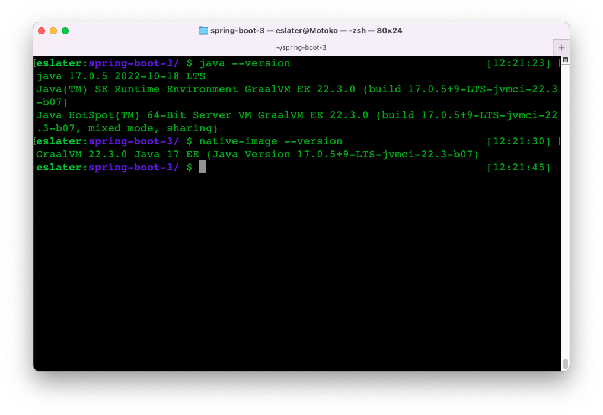
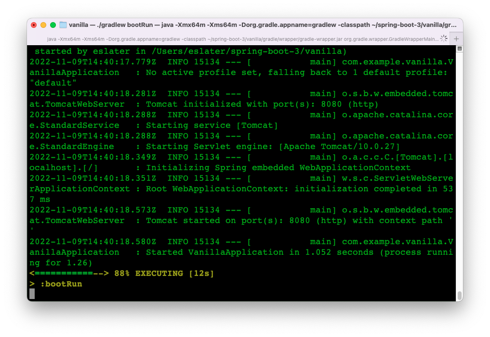
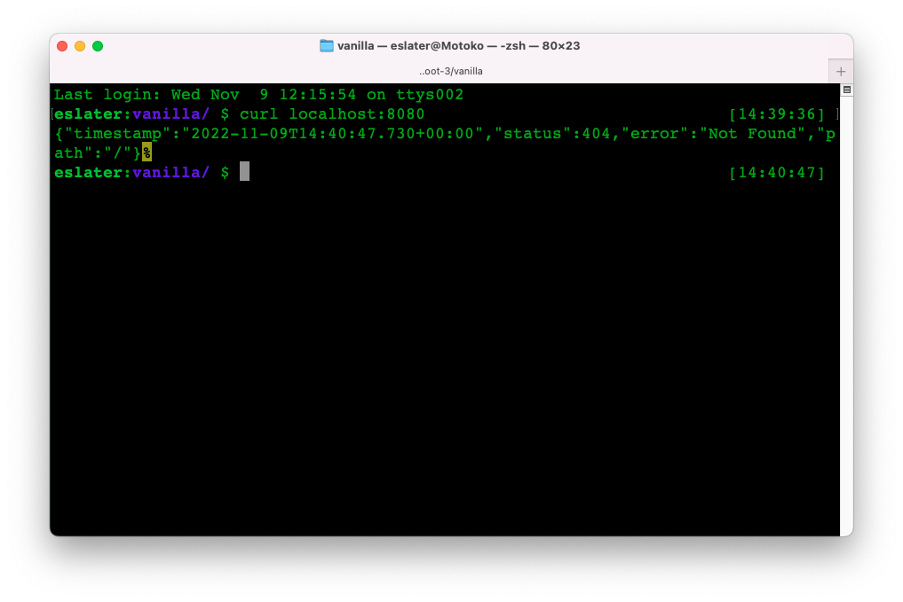
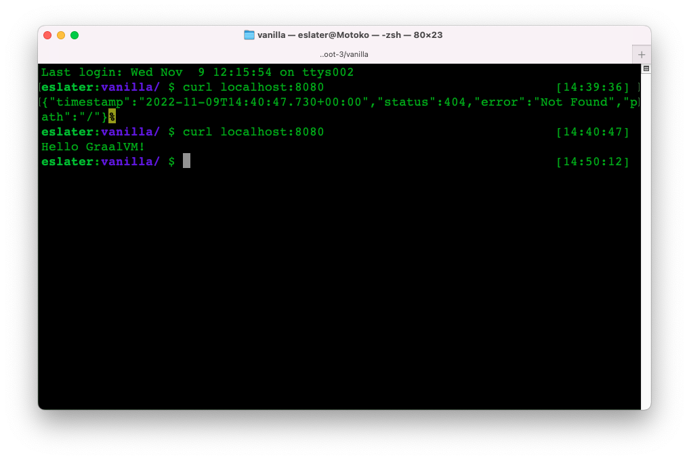
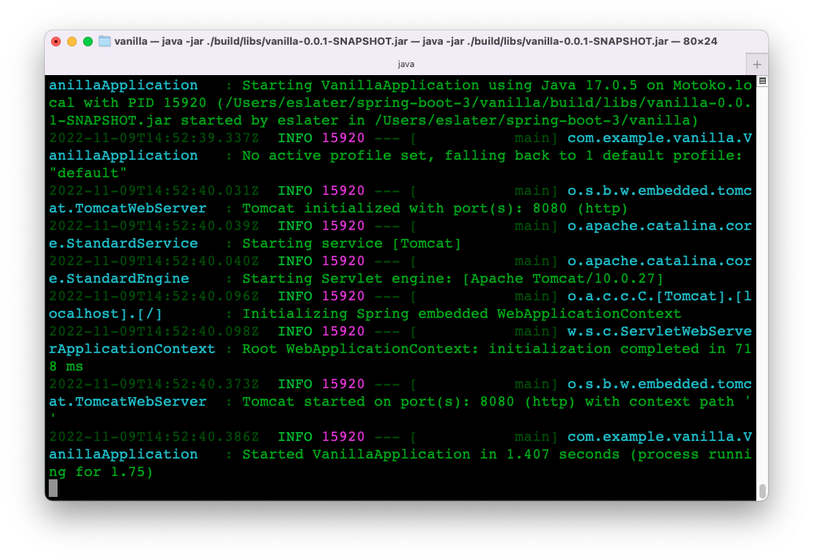
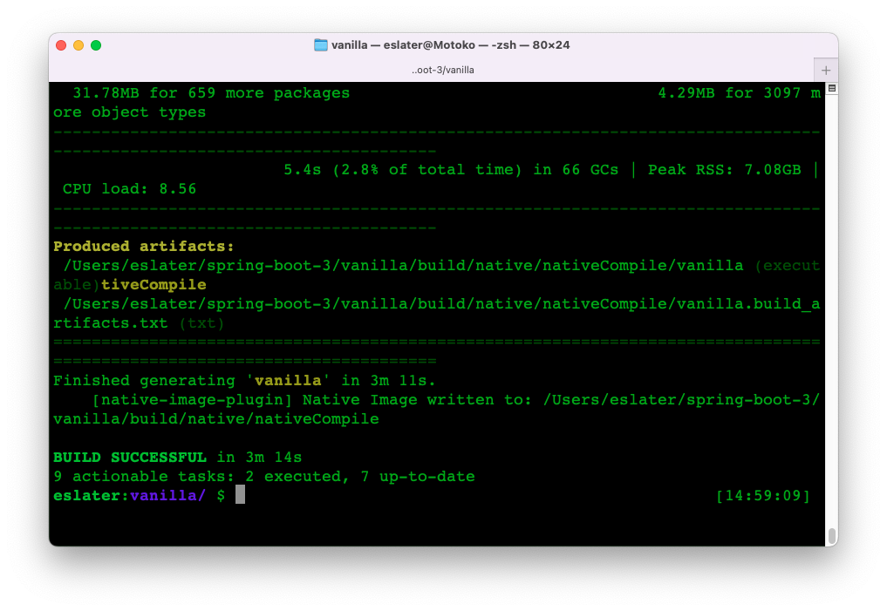
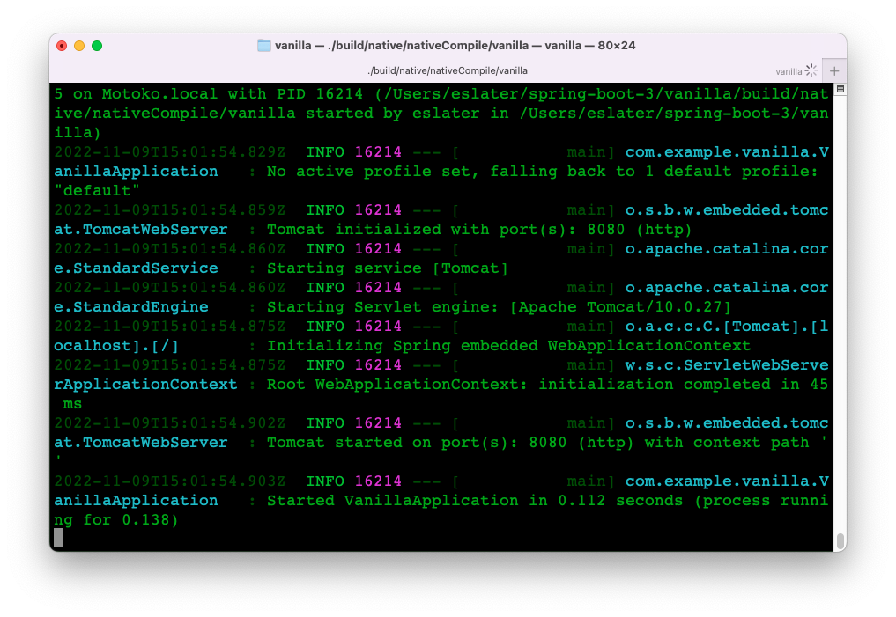
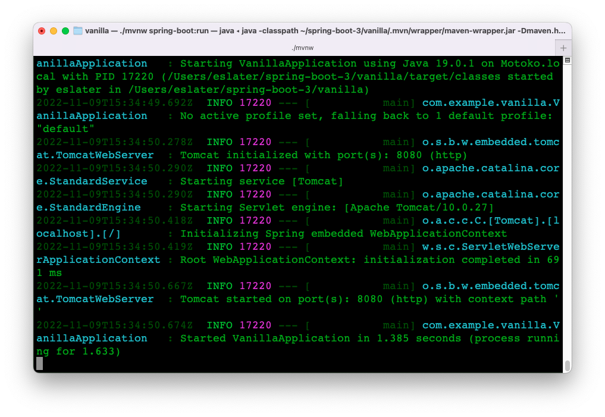
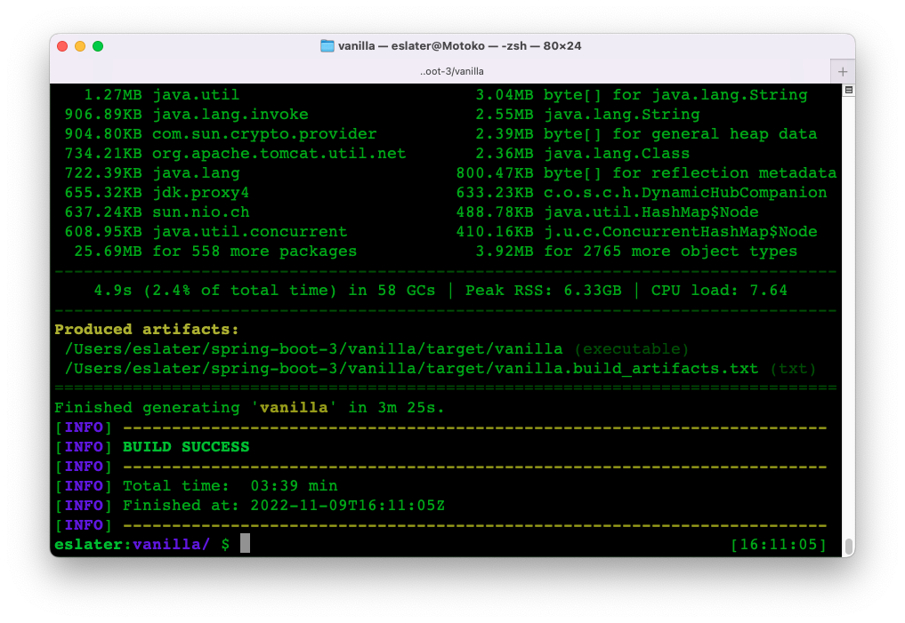
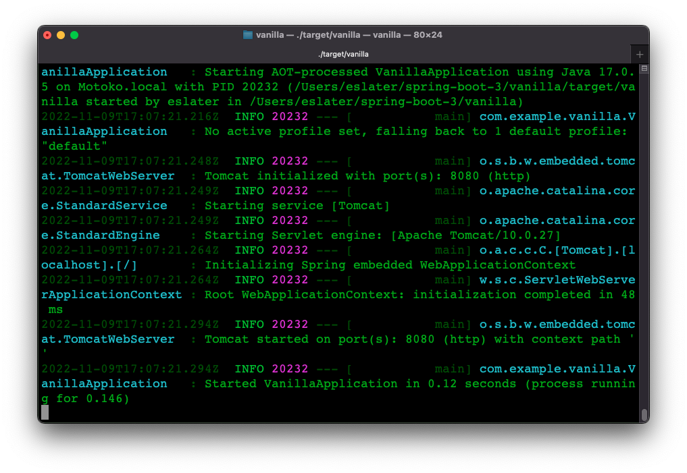

# Go Native with Spring Boot 3 and GraalVM

## Introduction

There has been a lot of interest in the past few years about "native Java".  You've probably read articles or seen conference talks on the subject.

### TL;DR - "native Java"
Traditionally Java programs are compiled to bytecode.  At runtime the bytecode is first interpreted and eventually compiled to native machine code by a JVM.

Native Java is the idea of using ahead-of-time (AOT) compilation to produce a native executable or "native image" for a Java application.

A native image can run standalone without relying on a JVM.

This approach potentially offers advantages in terms of:
- faster application startup
- lower latency
- lower memory and CPU footprint and cost

[GraalVM](https://www.graalvm.org) is an open source JDK that can compile Java applications to native images, as well as bytecode in the traditional way.

### Native Java and Spring
Spring is the most popular Java application framework used today.

Over the last three years, the Spring and GraalVM teams have been working to make it easier for developers to deliver their Spring applications as native images.

_Experimental_ support for native image was achieved via the [Spring Native](https://docs.spring.io/spring-native/docs/current/reference/htmlsingle/) project.

With Spring Boot 3 and Spring 6 (due to be released November 24, 2022), support for native image will be available as a core feature.

Since the release candidate for Spring Boot 3 is [now available](https://spring.io/blog/2022/10/20/spring-boot-3-0-0-rc1-available-now), this seems a good time to try out the native image support.

## Trying it out
So lets have a go at using the Spring Boot 3 release candidate and GraalVM to create a simple web application, compiled to a native executable.

### Pre - requisites

You need to have GraalVM and it's `native-image` tool installed on your machine.

You can download these from [here](https://www.graalvm.org/downloads/).

Note that you need GraalVM 22.**3**.0 and the equivalent version of `native-image`.

I'm using GraalVM Enterprise and `native-image` 22.3.0



### The Spring Boot App
The easiest way to get started with building a Spring Boot app is to use the [spring initializr](https://start.spring.io/).

I'm going to walk through using both Maven and Gradle, so you can pick whichever one you pefer.

You can either enter the configuration by hand, or re use one of:
- [Gradle configuration](https://start.spring.io/#!type=gradle-project&language=java&platformVersion=3.0.0-RC1&packaging=jar&jvmVersion=17&groupId=com.example&artifactId=vanilla&name=vanilla&description=Demo%20project%20for%20Spring%20Boot&packageName=com.example.vanilla&dependencies=native,web)
- [Maven configuration](https://start.spring.io/#!type=maven-project&language=java&platformVersion=3.0.0-RC1&packaging=jar&jvmVersion=17&groupId=com.example&artifactId=vanilla&name=vanilla&description=Demo%20project%20for%20Spring%20Boot&packageName=com.example.vanilla&dependencies=native,web)

After choosing the build engine, I selected:
- Spring Boot: 3.0.0 (RC1)
- Language: Java
- Artifact: Vanilla
- Dependencies:
  - GraalVM Native Support
  - Spring Web

Once you are happy with your configuration click the "GENERATE" button.

Then copy the downloaded file to a directory of your choice, unzip it and `cd` into the `vanilla` directory.

#### Gradle

Start by running the application:

`./gradlew bootRun`

The application should start in a second or so:



You can use `curl localhost:8080` to test the application:



`404` isn't a good look, so let's add a `RestController` to say something more meaningful.

Copy [Hello.java](./code/Hello.java) from the code directory into `./src/main/java/com/example/vanilla` (or write your own).

If we run the application (`./gradlew bootRun`) and test it (`curl localhost:8080`) again we should see a more meaningful response this time:



We can also build a stand alone jar:

`./gradlew assemble`

And run that:

`java -jar ./build/libs/vanilla-0.0.1-SNAPSHOT.jar`

Again you should see the app start in about a second:



So now we can take the next step and build our native image without having to make any changes to the project:

`./gradlew nativeCompile`

This may be a good opportunity to have a tea or coffee as it will take two or three minutes as opposed to a couple of seconds for building a jar (_on my Mac, YMMV_).

Once the build completes:



We can run the executable `./build/native/nativeCompile/vanilla`

You should see the application start in around ~0.1 seconds (so about 10x faster).



Looking at memory usage on my machine, the `native image` uses about 1/3 of the memory compared to running the application from the `jar`.

#### Maven

Before you start, make sure that `$JAVA_HOME` is set to point to your GraalVM installation:

```
$ $JAVA_HOME/bin/java --version
java 17.0.5 2022-10-18 LTS
Java(TM) SE Runtime Environment GraalVM EE 22.3.0 (build 17.0.5+9-LTS-jvmci-22.3-b07)
Java HotSpot(TM) 64-Bit Server VM GraalVM EE 22.3.0 (build 17.0.5+9-LTS-jvmci-22.3-b07, mixed mode, sharing)
```

Then run the application:

`./mvnw spring-boot:run`

The application should start in a second or so:



You can use `curl localhost:8080` to test the application:


`404` isn't a good look, so let's add a `RestController` to say something more meaningful.

Copy [Hello.java](./code/Hello.java) from the code directory into `./src/main/java/com/example/vanilla` (or write your own).

If we run the application (`./mvnw spring-boot:run`) and test it (`curl localhost:8080`) again we should see a more meaningful response this time:


We can also build a stand alone jar:

`/.mvnw package`

And run that:

`java -jar ./target/vanilla-0.0.1-SNAPSHOT.jar`

Again you should see the app start in about a second.

So now we can take the next step and build our native image without having to make any changes to the project:

`./mvnw -Pnative native:compile`

This may be a good opportunity as it will take two or three minutes as opposed to a couple of seconds for building a jar (_on my Mac, YMMV_).

Once the build completes:



We can run the executable `./build/native/nativeCompile/vanilla`

You should see the application start in around ~0.1 seconds (so about 10x faster).



Looking at memory usage on my machine, the `native image` uses about 1/3 of the memory compared to running the application from the `jar`.

## Summary

So in summary, with Srpring Boot 3.0, you can now easily leverage GraalVM Native image to build your applications as native executables.

Enjoy your faster startup, lower latency and lower infrastructure costs.
